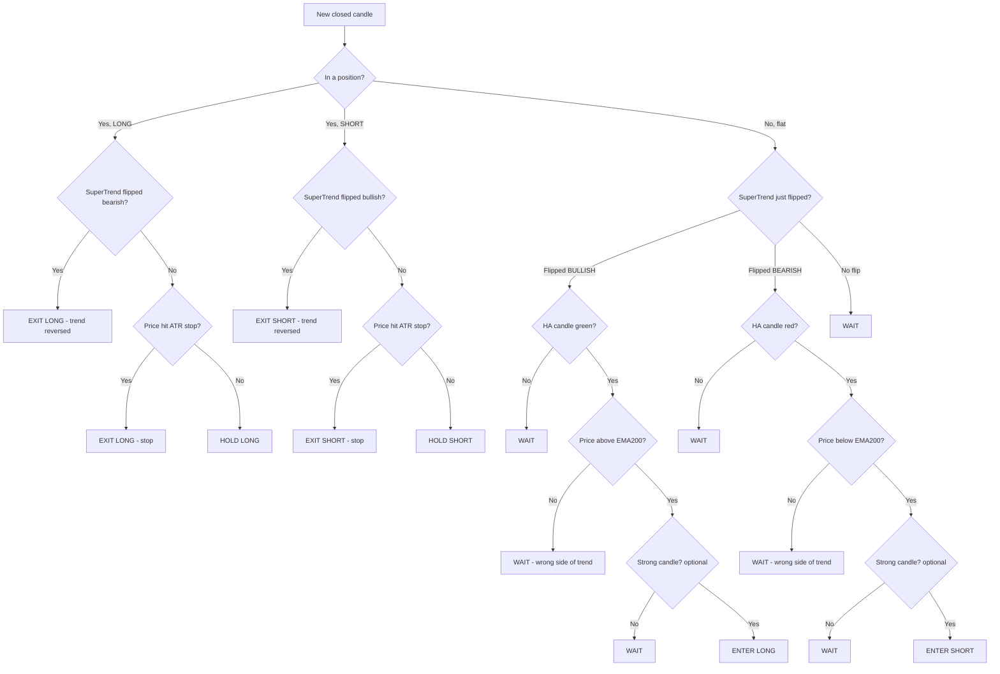

# Heikin Ashi + SuperTrend — Decision-Tree Trading Plan

A trend-following plan built from two indicators that each do one job, wired
together as a **decision tree** so every bar has exactly one answer: *long,
short, hold, or wait.* No discretion, no "it looks like it might" — you walk the
tree top to bottom and take the leaf it lands on.

- **On TradingView:** [`heiken-ashi-supertrend.pine`](../heiken-ashi-supertrend.pine) — a `strategy()` script you can drop on any chart and backtest in the Strategy Tester.
- **In this repo:** [`rules-heiken-ashi-supertrend.json`](../rules-heiken-ashi-supertrend.json) — the same logic in the bot's `rules.json` schema, for the safety check.
- **Validation:** [`backtest-hast.js`](../backtest-hast.js) — a Node backtest over 8 years of daily BTC.

---

## The two indicators (plus one filter)

| Tool | Setting | Its one job |
|------|---------|-------------|
| **SuperTrend** | ATR 10, multiplier 3.0 | **Direction.** Green line under price = uptrend, red line over price = downtrend. A *flip* is the trigger. |
| **Heikin Ashi** | standard | **Confirmation.** Smoothed candles filter noise. A green HA candle confirms buyers, red confirms sellers. |
| **EMA (filter)** | length 200 | **Bias gate.** Longs only above it, shorts only below it. Keeps you on the right side of the bigger trend. |

Heikin Ashi candles are computed from the real OHLC, not plotted price:

```
haClose = (open + high + low + close) / 4
haOpen  = (previous haOpen + previous haClose) / 2
haHigh  = max(high, haOpen, haClose)
haLow   = min(low,  haOpen, haClose)
```

A candle is **green** when `haClose > haOpen`, **red** when `haClose < haOpen`.
A candle is **strong** when the opposing wick is small (≤ 30 % of the body) — a
green candle with almost no lower wick means the up-move barely gave anything
back. The strong-wick gate is optional (off by default).

---

## The decision tree

Walk this on **every closed candle.** Start at the top. Follow the branch that
is true. The leaf is your action.



### Node-by-node

| # | Node | Long branch | Short branch |
|---|------|-------------|--------------|
| 1 | **SuperTrend flip** | line just turned green (up) | line just turned red (down) |
| 2 | **HA colour** | current HA candle is green | current HA candle is red |
| 3 | **EMA filter** | close is above EMA200 | close is below EMA200 |
| 4 | **Strong wick** *(optional)* | lower wick ≤ 30 % of body | upper wick ≤ 30 % of body |
| ▶ | **Leaf** | all true → **ENTER LONG** | all true → **ENTER SHORT** |

If any node fails, the leaf is **WAIT** — do nothing until the next candle and
walk the tree again. The `heiken-ashi-supertrend.pine` dashboard shows these
exact node states live, so the chart reads like this table in real time.

---

## Rules, in plain words

**Entry**
- **Long:** SuperTrend flips bullish **and** the Heikin-Ashi candle is green **and** price is above the EMA200. *(Optionally also require a strong candle.)*
- **Short:** SuperTrend flips bearish **and** the Heikin-Ashi candle is red **and** price is below the EMA200. *(Optionally also require a strong candle.)*

**Exit**
- The SuperTrend flips against you → close immediately. This is the primary exit; it lets winners run for the whole trend leg.
- Price hits the **ATR hard-stop** (2 × ATR from entry) → close. This is the disaster brake for a violent gap against the position before SuperTrend catches up.

**Risk**
- One position at a time — no pyramiding, no averaging down.
- Size each trade at ≤ the repo's `MAX_TRADE_SIZE_USD`; risk ≤ 1 % of the portfolio per trade (distance to the ATR stop sets the size).
- Cap trades per day with `MAX_TRADES_PER_DAY`.
- Never override the stop. The tree exits you; you don't hold and hope.

**Timeframe**
- Designed for **trend legs**, so it shines on 1H / 4H / 1D. The tree itself is timeframe-agnostic.
- For scalping (1m–5m) drop the EMA filter to 50, tighten the ATR multiplier toward 2.0, and expect many more, smaller trades. Paper-trade the faster settings first — noise eats trend-followers on low timeframes.

---

## Backtest — is it any good?

Run over **8 years of daily BTC/USD** (`btc-daily-binance.csv`, 3000 bars,
2018-04-15 → 2026-07-01), starting at $1000, 80 % of equity per trade, fills on
bar close:

| Variant | Return | Trades | Win rate | Profit factor | Max drawdown | Sharpe |
|---------|-------:|-------:|---------:|--------------:|-------------:|-------:|
| Raw tree (no filter) | +19.6 % | 71 | 29.6 % | 1.05 | 62.6 % | 0.25 |
| **+ EMA200 filter** *(default)* | **+152.3 %** | 36 | 33.3 % | **1.59** | 39.4 % | **0.55** |
| + strong-wick gate | +17.8 % | 67 | 28.4 % | 1.04 | 59.2 % | 0.24 |
| + EMA200 + strong-wick | +151.5 % | 33 | 33.3 % | 1.57 | 34.0 % | 0.55 |

**The EMA200 filter is the whole story.** It roughly **doubles the profit
factor and halves the drawdown** by throwing away counter-trend flips — the raw
tree bleeds out fighting the higher-timeframe trend. That's why the filter is
**on by default** in both the Pine and the JSON.

The low win rate (~33 %) is expected and healthy for a trend-follower: most
flips are small losses, and a handful of trades that ride an entire trend leg
carry the account. Profit factor > 1.5 with < 40 % winners means the winners are
big. Don't "fix" the win rate — it would cut the winners.

A grid search (`node backtest-hast.js --optimize`) found faster settings
(ATR 7, multiplier 2.5, EMA100) reaching much higher returns, but those are
optimised in-sample — treat them as a curiosity, not a recommendation. **The
robust default beats the tuned optimum for real trading** precisely because it
wasn't fit to this one price series.

> **Note on the sample:** this is a single asset (BTC) on one timeframe. Good
> backtest numbers are necessary, not sufficient. Re-run on your asset and
> timeframe, then paper-trade before risking a dollar.

---

## How to use it

### On TradingView

1. Open the Pine Editor, paste [`heiken-ashi-supertrend.pine`](../heiken-ashi-supertrend.pine), and **Add to chart**.
2. Open the **Strategy Tester** tab — the equity curve, trade list, and stats populate automatically. The script's defaults ($1000 capital, 80 % equity per trade, 0.06 % commission, fills on close) mirror the Node backtest so the numbers line up.
3. Read the **decision-tree dashboard** (bottom-right): it shows the live state of each node — SuperTrend, HA candle, EMA filter, wick, and the resulting Decision — so you can see exactly why it did (or didn't) fire.
4. **Automate the bot:** the script emits plain-text **`BUY` / `SELL`** signals — the exact contract `server.js` scans for (it does *not* parse JSON). Fill the **Bot Webhook Secret** input, then create one alert of type **"Any alert() function call"** pointed at `http://YOUR_BOT_HOST/webhook`. It fires `BUY` on a long entry / short cover and `SELL` on a short entry / long exit. The matching `alertcondition`s carry the same keyword for phone/email notifications.

### In this repo

```bash
# Full backtest + variant comparison + trade log
node backtest-hast.js

# Grid-search ATR period / multiplier / EMA length, ranked by Sharpe
node backtest-hast.js --optimize

# Run against a different CSV (same Date,Open,High,Low,Close,Volume format)
node backtest-hast.js path/to/your-data.csv
```

To wire it into the live bot, point the safety check at
[`rules-heiken-ashi-supertrend.json`](../rules-heiken-ashi-supertrend.json) —
its `entry_rules` are the tree's leaves, so every entry condition is checked
before an order goes through.

---

## Parameters

| Parameter | Default | Effect |
|-----------|---------|--------|
| ATR Length | 10 | SuperTrend responsiveness. Lower = flips sooner. |
| ATR Multiplier | 3.0 | Band width. Higher = fewer, later flips (more trend, less noise). |
| EMA Trend Filter | on, 200 | The bias gate. Turning it off roughly halves profit factor — leave it on. |
| Require Strong Candle | off, 30 % | Extra momentum gate on the HA wick. Fewer trades, similar edge. |
| ATR Stop Multiplier | 2.0 | Hard-stop distance from entry, in ATRs. |
| Allow Longs / Shorts | both on | Disable one side to trade with a directional view. |

---

**This is not financial advice.** It's a mechanical plan you can test and audit.
Build it properly, run the backtest on *your* market, paper-trade it, and never
risk more than you can afford to lose. The tree removes discretion from the
trade; it does not remove risk.
