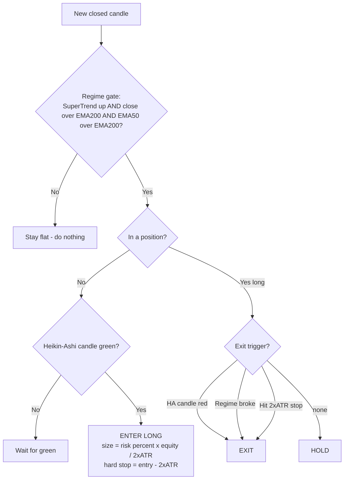

# Heikin Ashi + SuperTrend — Pro Colour Variant

A sharpened, long-only evolution of the [base decision-tree plan](heiken-ashi-supertrend-plan.md).
Same two indicators, but the strategy was rebuilt around three findings from
systematic testing on 8 years of daily BTC: **trade the colours, only inside a
confirmed regime, and size by risk.**

- **On TradingView:** [`heiken-ashi-supertrend-pro.pine`](../heiken-ashi-supertrend-pro.pine) — long-only `strategy()`, risk-sized, with a live decision-tree dashboard.
- **Backtest + validation:** [`backtest-hast-pro.js`](../backtest-hast-pro.js) — variant comparison, sizing ladder, and the out-of-sample checks.
- **Bot spec:** [`rules-heiken-ashi-supertrend-pro.json`](../rules-heiken-ashi-supertrend-pro.json)

---

## The decision tree



### In words

| Node | Rule |
|------|------|
| **① Regime gate** | Long trades allowed *only* when **SuperTrend is bullish** AND **close > EMA200** AND **EMA50 > EMA200**. Outside that, flat. |
| **② Entry** | Inside the regime, enter on the **first green Heikin-Ashi candle**. |
| **③ Sizing** | Size the position so the 2×ATR stop equals a fixed **% of equity** (risk-based). |
| **④ Exit** | Close on the **first red HA candle**, OR a **regime break** (SuperTrend flips / close < EMA200 / EMA50 < EMA200), OR the **2×ATR hard-stop**. |

There is **no breakeven stop, no scale-out, no trailing stop** — every one was
tested and every one hurt (see below). The discipline is subtraction.

---

## Why it's built this way — the evidence

Each design choice beat the alternatives on the daily BTC backtest ($1000 start).

**Long-only.** Splitting P&L by side, longs made **$1,428** and shorts **$95** —
shorts were nearly pure cost. Dropping them raised win rate and cut drawdown.

**Regime gate (EMA50 > EMA200).** The medium-term structure must have already
turned. This filter held up out-of-sample across every era and doesn't lean on
the bull run (it's inert there — EMA50 is always above EMA200 in a strong trend).

**Colours for entry *and* exit.** Following the candle colour *inside* the regime
turns the raw colour-follow system (700+ trades, 79% drawdown) into a controlled
one. The colour exit is the win-rate lever: exiting on the first red candle is a
fast, efficient trail.

**Risk-based sizing — the biggest single lever.** Same trades, same win rate, but:

| Sizing | Return | PF | Max DD | Sharpe | Return/DD |
|--------|-------:|---:|-------:|-------:|----------:|
| Blunt 80% of equity | 300% | 1.56 | 36.6% | 0.83 | 8.2 |
| **Risk 2% per trade** | 107% | 2.15 | 10.4% | **1.10** | 10.3 |
| **Risk 5% per trade** | **368%** | 1.92 | 23.9% | 1.07 | **15.4** |

Proper sizing revealed the strategy's true profit factor (~2.1, hidden by the
crude 80% sizing) and let you dial return with the risk %, each level at a known,
controlled drawdown. **Risk 5% beats the blunt 80% on return *and* drawdown.**

**What was rejected** (risk 5%, colour exit = 1.07 Sharpe):

| Overlay | Sharpe | Verdict |
|---------|-------:|---------|
| + breakeven stop @1R | 0.83 | shaken out flat, then it runs |
| chandelier trail (3×ATR) | 0.68 | looser than the colour exit; gives back gains |
| scale 50% @2R + trail | 0.66 | caps the winners the system needs |

---

## Out-of-sample validation

The config was chosen on the full sample, then checked on windows it wasn't
tuned to. Fresh $1000 per window; cells are **Return · Win% · PF · Sharpe (trades)**.

| Window | Pro Colour (risk 5%) | Simple HA+ST dual-EMA |
|--------|---------------------|-----------------------|
| FULL 2018–2026 | 368% · 37% · 1.92 · 1.07 (139) | 220% · 38% · 2.09 · 0.69 (29) |
| '20–'21 bull | 65% · 37% · 1.83 · 1.20 (46) | 127% · 50% · 6.21 · 1.49 (4) |
| '22–'23 bear | 34% · 32% · 2.44 · 1.06 (25) | 18% · 43% · 1.62 · 0.46 (7) |
| '24–'26 recent | 53% · 43% · 1.78 · 0.95 (47) | 70% · 46% · 2.22 · 0.98 (13) |

**Train/test holdout (split 2023-07-01):**

| Window | Pro Colour | Simple HA+ST dual-EMA |
|--------|-----------|-----------------------|
| TRAIN → 2023.5 | 141% · 35% · 1.88 · **1.03** (78) | 111% · 38% · 2.34 · 0.68 (16) |
| **TEST 2023.5 →** | 93% · 39% · 1.93 · **1.15** (62) | 70% · 46% · 2.22 · 0.89 (13) |

The decisive result: the **unseen TEST period (Sharpe 1.15, PF 1.93) performed as
well as or better than TRAIN (Sharpe 1.03, PF 1.88).** When the holdout matches
the training data, the edge is real rather than curve-fit. Profit factor stayed
in a tight 1.78–2.44 band across every era — no period breaks it.

> **The simple HA+ST dual-EMA reference also holds up** — fewer, higher-PF trades.
> It's the lower-activity cousin. Pick Pro Colour for activity and risk-adjusted
> return; pick the [base plan](heiken-ashi-supertrend-plan.md) for fewer, cleaner trades.

---

## Using it

**TradingView** — paste [`heiken-ashi-supertrend-pro.pine`](../heiken-ashi-supertrend-pro.pine),
Add to chart, open the Strategy Tester. Set **Risk % of equity per trade** to your
tolerance (2% prudent, 5% aggressive "max"). The dashboard shows the live regime
gate and decision so the chart reads like the tree above.

**Repo backtest:**
```bash
node backtest-hast-pro.js                 # full report + sizing ladder + out-of-sample
node backtest-hast-pro.js your-data.csv   # any Date,Open,High,Low,Close,Volume CSV
```

**Other timeframes (e.g. 1H for prop challenges).** The validated numbers here
are all **daily**, which trades slowly (~15–25×/yr). A lower timeframe trades far
more often and can hit a prop profit target faster inside the drawdown limit.
The backtest auto-detects the interval and annualises Sharpe accordingly, so just
feed it a lower-timeframe CSV. Fetch one locally (exchange APIs are blocked in
cloud sandboxes, so this must run on your own machine):
```bash
node fetch-ohlc.js BTCUSDT 1h btc-1h.csv 2023-01-01   # pull hourly candles
node backtest-hast-pro.js btc-1h.csv                  # backtest them
```
Treat lower-timeframe results as **unvalidated until you run them** — more trades
also means more whipsaw and more fee/slippage drag, which daily is largely immune to.

**Automate the bot (webhook).** The Pine emits **plain-text `BUY` / `SELL`**
signals — the exact contract `server.js` expects (it scans the alert body for
those words; it does *not* parse JSON). Since this variant is long-only in spot,
**BUY = enter, SELL = exit (flatten).**

1. Fill the **Bot Webhook Secret** input with your `WEBHOOK_SECRET` (it's sent as a
   prefix on the message; it stays in your chart settings, never in the script).
   Make sure that secret doesn't contain the letters `buy` or `sell` — the bot
   keyword-matches the whole body and checks `BUY` first.
2. Create **one** alert, condition **"Any alert() function call"**, Webhook URL
   `http://YOUR_BOT_HOST/webhook`. That single alert fires `BUY` on entry and
   `SELL` on exit.
3. Prefer notifications instead? The `HA+ST Pro — BUY` / `— SELL` alertconditions
   carry the same keyword (minus the secret) for phone/email.

> The intrabar 2×ATR hard-stop is a backtest safety and won't emit its own SELL —
> the 1-candle colour exit almost always fires first, and the bot runs its own
> stop. Keep the bot in paper/spot mode until you've watched it live.

---

## Config reference

| Parameter | Default | Note |
|-----------|---------|------|
| SuperTrend | ATR 10 × 3.0 | regime direction |
| Trend EMA (slow) | 200 | price must be above it |
| Regime EMA (fast) | 50 | EMA50 > EMA200 = up-regime; robust 50–100 |
| Risk % per trade | 2.0 | the return dial — 5% is the backtest "max" |
| Stop distance | 2 × ATR | hard stop and the 1R risk unit |
| Direction | long-only | shorts were a net drag on this asset |

---

## Honest caveats

- **Single asset.** All of this is BTC daily. Risk-based sizing is a universal
  principle, but the colour/regime specifics should be re-checked on your market
  and timeframe — the repo blocks external market-data fetches, so run
  `fetch-binance.js` with another symbol locally and re-run the backtest.
- **Long-only leans on crypto's up-drift.** In a long secular bear, the
  regime gate keeps you *flat* (not short) — that's protection, not profit.
- **Risk % sets your drawdown.** 5% gave ~24% max drawdown historically; future
  drawdowns can be larger. Size to what you can actually sit through.
- **This is not financial advice.** Paper-trade it first. The tree removes
  discretion from the trade; it does not remove risk.
